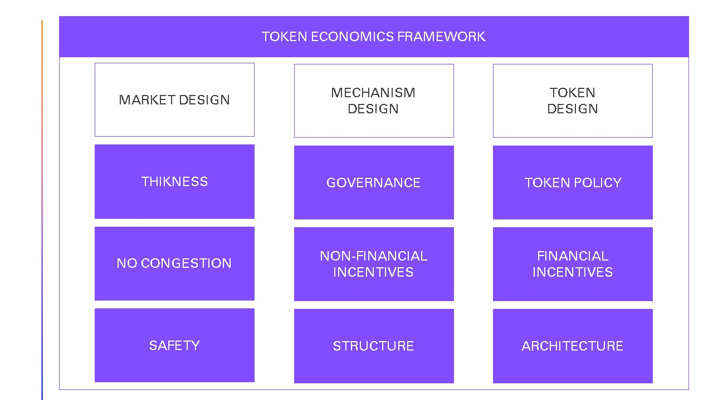

# 💰 Economics Fundamentals

In an Ideal World there will be one model that serves all the different ecosystem purposes, unfortunately we do not live in an Ideal World and there's no ideal ecosystem that fits all the crypto ecosystems so when it comes to token there isn't one ideal token economy We cannot take a model that could fit in all your different ecosystems. With that being said, there are economic frameworks available. We'll talk about different perspectives and different aspects and principles to apply into building your ecosystem.

Economics design is much more about principles or having just one model that fits your ecosystem. It's not about designing the token of the ecosystems, it's a lot more: it's about resolution, about governance, about monetary policy, about your network effect, about your network design, about incentives design model. There's so many aspects into that. We're going to cover three matters in order to start building our ecosystem.

So we're going to Deep dive into 3 main aspects:

1. What is the economics framework.&#x20;
2. What are the elements to consider.&#x20;
3. How to use them.

But first we must understand the basic ecomomic element: <mark style="color:green;">**the token.**</mark>

### <mark style="color:purple;">**What is a Token?**</mark>

A token represents a created (imprinted) value within the ecosystem. It is where the different participants consider it as a valuable asset. For this there are different types of tokens, utility-type tokens, stable-type tokens such as stable coins and security-type tokens.&#x20;

### <mark style="color:purple;">What is the economics framework?</mark>

When you talk about token economics it is not about just simply applying the economics that it's available and applying it to a digital system.

Economics changes and evolves. So when we talk about the old model of economics we must consider things like cost of production. Because production usually is measured by the cost of all the materials and the service involved, we then must consider the cost of delivering that product to the consumers hands. Whenever we create or we build an asset, let's take for example an iPhone, we calculate the cost of all the materials that compose that phone. When we produce another iPhone there's another cost which is based on the cost of the production of the first item.

This cost is called **marginal cost**.This cost is more than zero because you must consider the raw materials for producing this additional iPhone. But for for an image, you just take a picture you send it to anyone and upload it. It's free, it's available to anyone. So there is no marginal cost. Because of that, the whole idea of supply and demand, the whole idea of cost, Has also changed, so the idea of digital Goods is different when we talk about initial cost.

So let's understand the economic principles. Economic principles generally do not change, or if they do, it takes time to settle the change. In order to materialize the evolution of economic principles, we have to break all economic concepts such as the principal agent model, game theory, asymmetric information, monetary policy, etc. to create an economic framework to meet the demands of the new digital commerce. This economic model is divided into three pillars

### <mark style="color:purple;">Market Design</mark>

How participants will trade the token, how they will interact with each other and the incentive model that will be created for these participants using these tokens. Represents the design of the environment.

### <mark style="color:purple;">Mechanism Design</mark>

Represents the design of rules. It deals with the business rules that must be applied to obtain an outcome. for example, if I need to have a specific result of a chess move I must change the rules of each of the pieces in order to obtain the expected result. Unlike game theory, in which specific rules are followed in order to obtain a result, mechanism design applies the opposite rule. The objective is the restructuring of the rules and mechanisms themselves to obtain a specific result.

### <mark style="color:purple;">Token Design</mark>

Represents the design of incentives. Token design is optional as in private blockchains they are not required. In the design of tokens, we apply strategies on these assets to encourage participants to trade.&#x20;

Let's understand each two concept of each pillar. The heart of this framework is the token incentive model.

#### <mark style="color:green;">Thickness</mark>

Represents the number of participants transacting on the network. If we have a high number of participants there may be congestion. The main problem with congestion is that participants are left with no trading options.

#### <mark style="color:green;">**No Congestion**</mark>

Congestion is an important point that must be considered. If there is congestion on the network, transaction fees will increase, therefore the cost of each product will increase, and it will not be interesting to execute transactions within this ecosystem and the network will lose participants.

#### <mark style="color:green;">**Safety**</mark>

For security we must ensure that participants will transact securely. For this we must guarantee levels of encryption on the application side as well as the choice of a platform that guarantees the security of transactions.

#### <mark style="color:green;">**Governance**</mark>

Governance determines the operating model in terms of conflict resolution and in terms of decision making. In centralized organizations, the governance pillar is not important as divisions and conflict resolution are carried out by the organization. In decentralized organizations, governance becomes a central part of the tokenomics strategy. Traditionally, the decision-making system in a decentralized organization is carried out through a voting system. There are different strategies for conflict resolution based on consensus, mutations can follow the same rules of systemic consensus as today's proof of investment, proof of authority, proof of participation, etc.

#### <mark style="color:green;">**Non financial incetives**</mark>

When we talk about non-financial incentives, we are not talking about tokens as tokens represent economic incentives. In the case of non-financial incentives, we are talking about the powers that participants can exercise, such as voting. In a community, we can offer incentives for the participation of both that community so that it is more active, as well as accelerate the economy of the Token itself by offering governance tokens, which represent these rights. Non-financial incentives are closely related to governance policies, where we are decentralizing responsibility. It is very important when designing the non-financial incentives strategy to consider defense mechanisms against corruption or imbalance in the power structure, for example: a user who has a high power of governance tokens and behaves like a bad actor. Additionally in this strategy we must consider the token allocation mechanism for the different participants. When we talk about allocation we must consider a systemic allocation. allocation strategy considers burning tokens, printing new tokens, recycling tokens, or generating investment-based incentives.

#### <mark style="color:green;">**Structure**</mark>

Determines what the token's pricing structure will be. The pricing structure may be via an auction, may be determined by sellers or by buyers. here we also determine what the pricing strategy will be for the Initial sale, for the secondary sale, and for the sale through different exchanges. In this strategy we must also consider the oracle structure if the pricing depends on external events, such as incentives within the decentralized finance environment.

#### <mark style="color:green;">**Token Policy**</mark>

Here we must consider different economic aspects in order to design our token. For example, we can here consider strategies such as interest rates, interest, incentive strategy related to inflation or deflation. In these policies we must also consider the specific value (valuation) of the Token, mainly in utility tokens.

#### <mark style="color:green;">**Financial Incetives**</mark>

Here we should consider token incentive strategy for participants. an example could be sales promotion incentives or benefits for stackers.

#### <mark style="color:green;">**Architecture**</mark>

Architecture deals with the implementation strategy of this token that can be fungible as ERC20 models, ERC1400 model, or non-fungible tokens as ERC721 models or ERC1155 model. Each of these models has different functions and characteristics. We must consider the different properties, rights and obligations of operation of each asset. An example contemplates specific rights of the ERC721 token holder. The persistence of Token 721 in the customer's wallet is independent of the continuity of the company that issued it.
